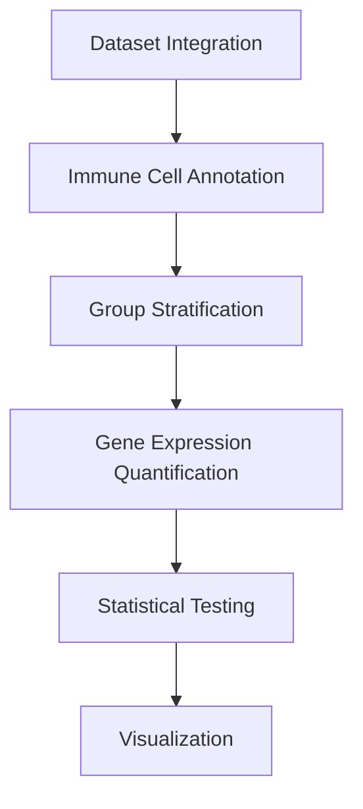

# GBM Immune Cell Gene Expression Analysis Workflow
## Healthy vs. Low-Grade vs. High-Grade Glioma



## 1. Dataset Integration

**Sources:**

| Group       | Dataset                      | Cells | Access           |
|-------------|-------------------------------|-------|------------------|
| Healthy     | Allen MTG Cortex              | 15,928| Link             |
| Low-Grade   | GLASS IDHmut (WHO II-III)     | ~60K  | GEO GSE222522    |
| High-Grade  | GLASS IDHwt (WHO IV)          | ~60K  | GEO GSE222522    |

**Integration Pipeline:**
- Diagram
- Code

## 2. Immune Cell Annotation

**Marker-Based Classification:**

| Cell Type      | Markers            | Expected Proportion |
|----------------|--------------------|----------------------|
| Microglia      | P2RY12+, TMEM119+  | Healthy: 80-90%      |
| TAMs           | CD68+, CD163+      | GBM: 30-40%          |
| CD8+ T cells   | CD8A+, CD3E+       | LGG: 5-15%           |
| Other Immune   | Cell-type specific | Varies by grade      |

## 3. Group Stratification

```python
# Metadata column creation
adata.obs['group'] = (
    'healthy' if 'Allen' in adata.obs.dataset_origin
    else 'low_grade' if ('GLASS' in adata.obs.dataset_origin) & (adata.obs.grade in ['II','III'])
    else 'high_grade'
)
```

## 4. Gene Expression Quantification

**Metrics for Comparison:**

| Metric             | Formula                              | Interpretation           |
|--------------------|--------------------------------------|---------------------------|
| % Expressing Cells | (Cells with >0 counts) / Total Cells | Prevalence of expression |
| Mean Expression    | log1p(mean(normalized counts))       | Expression intensity     |

## 5. Statistical Testing

**Non-parametric Framework:**
- Diagram
- Code

## 6. Visualization Templates

**Dot Plot (Scanpy):**

```python
sc.pl.dotplot(
    adata_immune,
    var_names=['P2RY12','CD274','GNLY'],
    groupby='group',
    categories_order=['healthy','low_grade','high_grade'],
    dendrogram=True
)
```

**Violin Plot:**

```python
sc.pl.violin(
    adata[adata.obs.cell_type=='Microglia'],
    keys='P2RY12',
    groupby='group',
    rotation=90
)
```

**Example Output Table**

| Gene   | Cell Type | Healthy (n=6) | Low-Grade (n=10) | High-Grade (n=10) | p (Overall) | p (H vs L) | p (H vs H) | p (L vs H) |
|--------|-----------|----------------|------------------|-------------------|--------------|-------------|-------------|-------------|
| P2RY12 | Microglia | 98.2±0.5        | 85.3±3.1         | 41.7±5.2          | 2.1e-14      | 0.003       | 6.2e-11     | 1.4e-09     |
| CD274  | TAMs      | 1.2±0.3         | 8.7±1.2          | 32.5±4.1          | 4.3e-12      | 0.021       | 8.1e-10     | 0.001       |
| GNLY   | CD8+ T    | 5.1±0.9         | 12.3±2.1         | 28.7±3.8          | 9.8e-08      | 0.18        | 3.2e-06     | 0.004       |

## Execution Workflow

- Diagram
- Code

### Ready to Run?

**Provide:**
- Target genes (e.g., immune checkpoints, cytokines)
- Priority cell types
- Output format needs (PDF/HTML report)

---

To use this:

1. Save as `GBM_Immune_Analysis.md`
2. Customize target genes/cell types in sections 4 and 6
3. Execute code blocks in Python environment with:

```bash
pip install scanpy harmonypy scipy matplotlib
```

For PDF export: Use `mdpdf` or `pandoc`:

```bash
pandoc GBM_Immune_Analysis.md -o workflow.pdf
```
